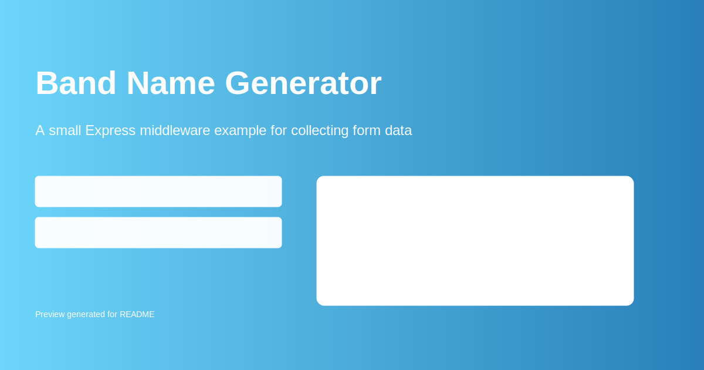

# Band Name Generator



**Description:**

A small Express middleware example that serves a simple form for generating band names from a street name + pet name combination. This project demonstrates basic middleware usage, body parsing, and form handling in an Express app.

**Features:**

- Simple HTML form in `public/index.html` to collect a street name and a pet name.
- Express middleware for parsing POST data (uses `body-parser` / built-in parsing).
- Minimal example suitable for learning middleware flow.

**Install:**

```bash
npm install
```

**Run:**

- Use Node directly: `node index4.js`
- Or use nodemon if you have it installed: `nodemon index4.js`

**Project Structure (key files):**

- `index1.js`, `index2.js`, `index3.js`, `index4.js` — example server files and middleware exercises.
- `public/index.html` — the example form.
- `public/preview.svg` — preview image used above.

**Author:**

- [WailHassan](https://github.com/wailhassan) (HybridLink)

**License:**

- ISC
